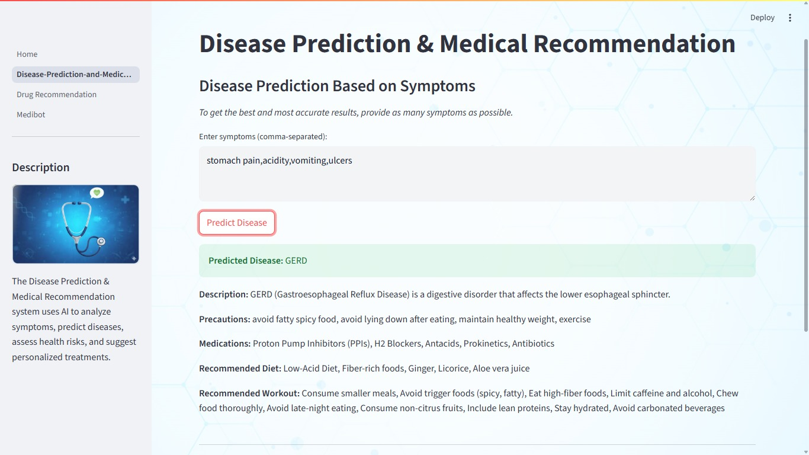
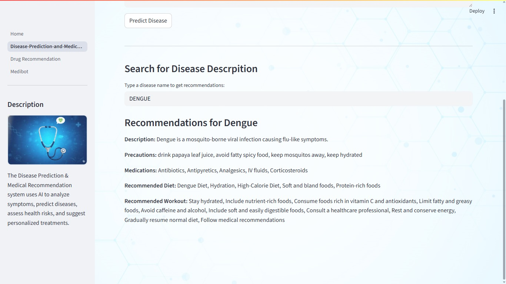
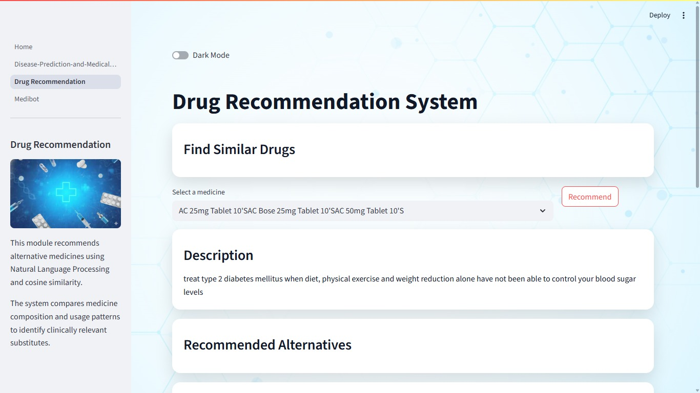
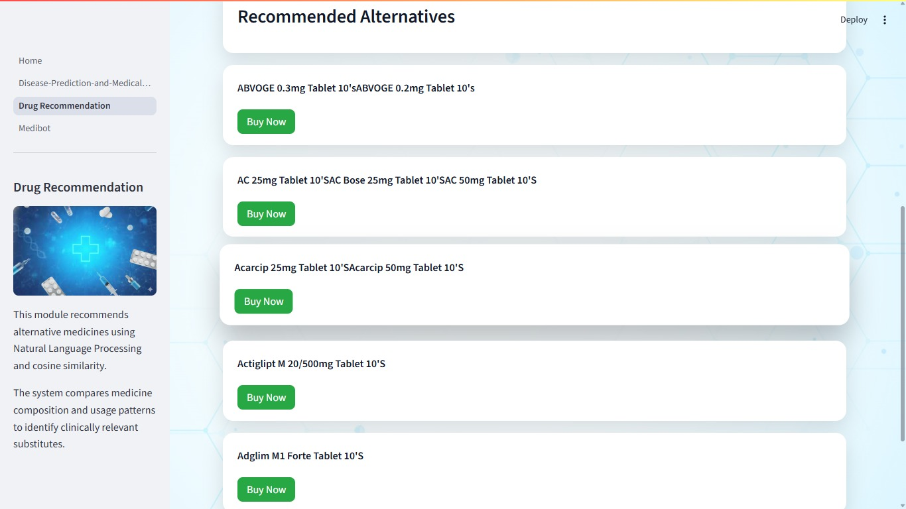
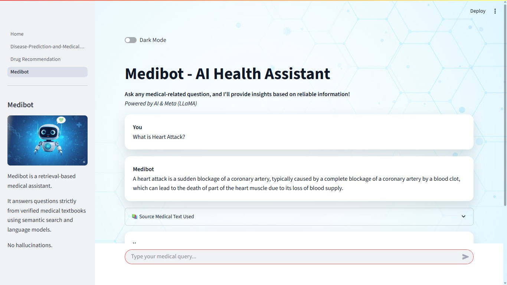
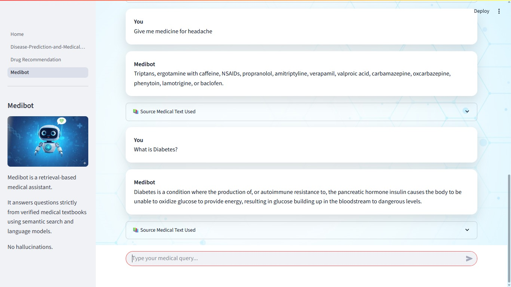

# 🏥 MediGuide

### AI-Based Disease Prediction and Medical Recommendation System with Medibot

MediGuide is an AI-powered healthcare support system that integrates **Machine Learning**, **Natural Language Processing (NLP)**, and **Large Language Models (LLMs)** to provide disease prediction, drug recommendation, and intelligent medical assistance through a unified platform.

---

## 🚀 Project Modules

### 🔬 Module 1: Disease Prediction & Medical Recommendation

This module predicts diseases based on user-reported symptoms using Machine Learning techniques and provides medical guidance.

**Features:**

* Symptom-based disease prediction
* Random Forest Classifier for accurate predictions
* Disease descriptions and precautionary measures
* Medication and diet recommendations

<p align="center">
  
  
</p>

### 💊 Module 2: AI-Powered Drug Recommendation

This module recommends alternative medicines based on drug properties and compositions using NLP techniques.

**Features:**

* NLP-based drug analysis
* Cosine similarity for drug matching
* Alternative medicine recommendations
* Supports safer and effective prescriptions
<p align="center">
  
  
</p>

### 🤖 Module 3: Medibot – AI Health Assistant

Medibot is an AI-powered healthcare chatbot that provides instant and reliable medical information using a Large Language Model.

**Features:**

* LLM-based chatbot using **Mistral-7B-Instruct**
* Retrieval Augmented Generation (RAG) for factual accuracy
* FAISS vector database for medical document retrieval
* Fast and context-aware healthcare responses
<p align="center">
  
  
</p>

## 🧠 System Workflow

1. User inputs symptoms, drug names, or medical queries
2. Disease prediction using Machine Learning model
3. Drug recommendation using NLP similarity techniques
4. Medical query handling via Medibot using RAG and FAISS
5. System generates reliable healthcare guidance

---

## 🛠️ Technologies Used

* **Programming Language:** Python
* **Machine Learning:** Random Forest Classifier
* **NLP Techniques:** TF-IDF, Cosine Similarity
* **LLM:** Mistral-7B-Instruct
* **Vector Database:** FAISS
* **Framework:** Streamlit
* **Libraries:** NumPy, Pandas, Scikit-learn, LangChain

---

## ⚙️ Installation & Setup

### 1. Clone the repository

```bash
git clone https://github.com/kaushalbharade/MediGuide.git
cd MediGuide
```

### 2. Create and activate virtual environment

```bash
python -m venv venv
venv\Scripts\activate
```

### 3. Install dependencies

```bash
pip install -r requirements.txt
```

### 4. Run the application

```bash
streamlit run Home.py
```

---

## ⚠️ Disclaimer

This project is intended for **educational and informational purposes only** and should **not** be considered a substitute for professional medical advice, diagnosis, or treatment.

---

## 🔮 Future Enhancements

* Multilingual chatbot support
* Voice-based medical interaction
* Mobile application deployment
* Integration with real-time clinical data
* Deep learning-based disease prediction

---

## 👨‍💻 Author

**Kaushal Bharade**
GitHub: [https://github.com/kaushalbharade](https://github.com/kaushalbharade)
